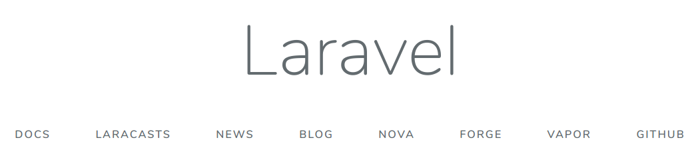

## Curso: Desenvolvimento de Aplicações Modernas e Escaláveis com Microsserviços

### Esse projeto faz parte do desafio publicando imagem laravel.

## Pré requesitos:
   - Docker com Docker composer

## Como utilizar

- Clone o repositório:
  ```bash
  git clone https://github.com/amauryeuzebio/  fullcycle7-projeto-imagem-laravel.git
  ```

- Configure as variaveis de ambiente:
  ```bash
  mv .env.example .env
  ```

- Executar o docker composer  
  ```bash
  docker-compose up -d
  ```

- Acessar via browser o endereço.
[http://localhost:8000](http://localhost:8000)




**OBS:** Foi gerado uma imagem e publicada no dockerhub, para acessar a imagem clique  [aqui](https://hub.docker.com/repository/docker/rodelima/projeto_publicando_imagem_laravel).
